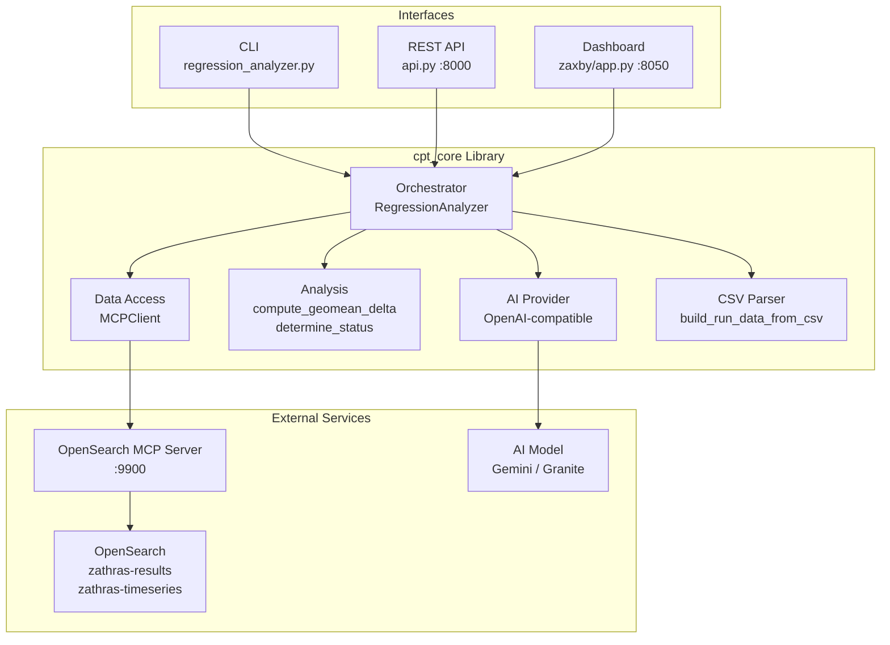
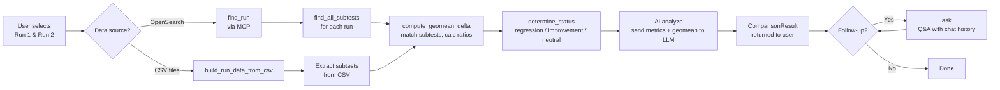

# CPT AI Architecture Flowchart

```mermaid
flowchart TD
    subgraph Interfaces
        CLI["CLI\nregression_analyzer.py"]
        API["REST API\napi.py :8000"]
        DASH["Dashboard\nzaxby/app.py :8050"]
    end

    subgraph cpt_core["cpt_core Library"]
        ORCH["Orchestrator\nRegressionAnalyzer"]
        DA["Data Access\nMCPClient"]
        AN["Analysis\ncompute_geomean_delta\ndetermine_status"]
        AI["AI Provider\nOpenAI-compatible"]
        CSV["CSV Parser\nbuild_run_data_from_csv"]
    end

    subgraph External["External Services"]
        MCP["OpenSearch MCP Server\n:9900"]
        OS["OpenSearch\nzathras-results\nzathras-timeseries"]
        LLM["AI Model\nGemini / Granite"]
    end

    CLI --> ORCH
    API --> ORCH
    DASH --> ORCH

    ORCH --> DA
    ORCH --> AN
    ORCH --> AI
    ORCH --> CSV

    DA --> MCP
    MCP --> OS
    AI --> LLM
```

## Comparison Pipeline

```mermaid
flowchart LR
    A["User selects\nRun 1 & Run 2"] --> B{"Data source?"}
    B -->|OpenSearch| C["find_run\nvia MCP"]
    B -->|CSV files| D["build_run_data_from_csv"]
    C --> E["find_all_subtests\nfor each run"]
    D --> F["Extract subtests\nfrom CSV"]
    E --> G["compute_geomean_delta\nmatch subtests, calc ratios"]
    F --> G
    G --> H["determine_status\nregression / improvement / neutral"]
    H --> I["AI analyze\nsend metrics + geomean to LLM"]
    I --> J["ComparisonResult\nreturned to user"]
    J --> K{"Follow-up?"}
    K -->|Yes| L["ask\nQ&A with chat history"]
    K -->|No| M["Done"]
    L --> K
```
